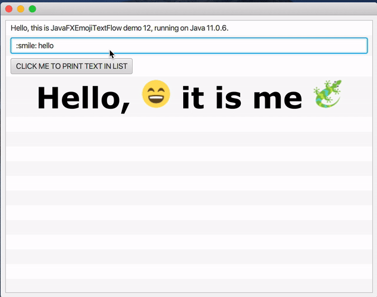
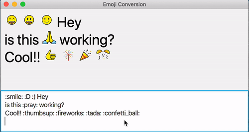

# Description
An extended JavaFX TextFlow with custom emoji images 
which helps you to achieve consistency in your JavaFX 
cross-platform UI applications displaying emojis along text.

It helps you to parse a plane text with emoji aliases with : around the alias
(ex. :smile: ) or unicode emoji symbols
to custom emoji images with text  
and wraps it in custom EmojiTextFlow that is based on JavaFX TextFlow

See demo GIFs with examples under `doc/img`

## How to use
Example code is in:
`src/main/java/ExampleJavaFXEmojiTextFlow.java`

### Dependency gradle local downloaded .jar files:
First you need to get `.jar` file with EmojiTextFlow from releases, here on github
(NOTE: following configuration is from `build.gradle` of `emoji-text-flow-demos/list-emoji-text-flow-local-libs-demo` demo project )
1. put your .jar in root `libs` directory of your javafx project.
2. add/change your build.gradle to have these lines:

```groovy
repositories {
    mavenCentral()
    flatDir {
        dirs 'libs'
    }
}

dependencies {
    //// MUST INCLUDE THESE DEPENDENCIES START
//    implementation name: 'JavaFXEmojiTextFlow_emojitwo-1.0'
//    implementation name: 'JavaFXEmojiTextFlow_openmoji-1.0'
    implementation name: 'JavaFXEmojiTextFlow_twemoji-1.0'

    // https://mvnrepository.com/artifact/org.sharegov/mjson
    compile group: 'org.sharegov', name: 'mjson', version: '1.3'
    // https://mvnrepository.com/artifact/org.slf4j/slf4j-api
    compile group: 'org.slf4j', name: 'slf4j-api', version: '1.7.25'
    // https://mvnrepository.com/artifact/org.slf4j/slf4j-simple
    compile group: 'org.slf4j', name: 'slf4j-simple', version: '1.7.25'
    //// MUST INCLUDE THESE DEPENDENCIES END
    // ... your other dependencies
}
```


run this example with:
```bash
./gradlew exampleEmojiTextFlowWithListView
```

## How to run example codes

#### Example of using EmojiTextFlow:
```bash
./gradlew exampleEmojiTextFlowWithListView
```
#### running example with *emojitwo* images:



#### Example real time typing and converting to emoji
```bash
./gradlew exampleTypingTextConversion
```
#### running example with *openmoji* images:



#### Example search emoji by their :name: (ex. :smile:)
##### WARNING: 
There is an old example code from https://github.com/UltimateZero/EmojiOneJava 
In this example EmojiTextFlow is NOT used. 
```bash
./gradlew oldExampleEmojiSearch
```
#### running example with *twemoji* images:


## Free emoji packs used in this project:

OpenMoji: https://github.com/hfg-gmuend/openmoji

Twemoji: https://github.com/twitter/twemoji

EmojiTwo: https://github.com/EmojiTwo/emojitwo/

you can add your own ...

## How to add my own emoji pack and use it instead of default ones?

> NOTE:
> you need to make sure you follow same naming of your 
> emoji `.png` files as in this project. 
> (See in `emoji_images` there are all 
> lowercase unicode emoji names for each emoji image file;
> emoji.json is used to search your files by names.)

#### 1. put your `my_awesome_emoji_pack` in `./emoji_images` next to other packs
#### 2. in `settings.gradle` give a value to `emojiImagesPath` variable like this:

> WARNING! the name of variable should be the save as your custom
> emoji pack directory name! In this example both are: `my_awesome_emoji_pack`
```gradle
gradle.ext.emojiImagesPath = 'my_awesome_emoji_pack'
```

#### 3. in terminal run:
```bash
./gradlew buildJar
```
#### 4. grab your custom emoji pack `jar` of EmojiTextFlow from `build/libs` and place it to your other project as a dependency

#### HINT: It is not necessary to have all emoji images in `.jar`
You can create your own emoji pack with 
only few of emoji .png images and recompile it by yourself. 
It will dramatically reduce `.jar` file size.

### Legal:
```
Copyright (c) 2016 MK Hejazy MIT License
```

### Credits:
https://github.com/UltimateZero/EmojiOneJava